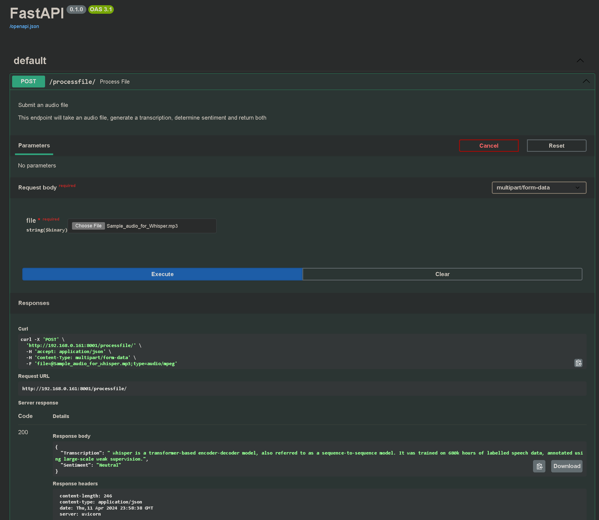

# Transcription Sentiment Analysis API

This project provides a RESTful API built with FastAPI for analyzing the sentiment of textual transcriptions. It utilizes models from HuggingFace to generate transcription and determine the underlying sentiment (positive, negative, neutral) in the provided text. The API is designed to be easy to use and integrate into existing systems or applications that require transcription and sentiment analysis capabilities.

## Features

- **FastAPI Framework**: Leveraging the high performance of FastAPI to handle requests asynchronously.
- **Sentiment Analysis**: Uses pre-trained NLP models to assess the sentiment of given text.
- **Docker Support**: Containerized application for easy deployment and scalability.

## Getting Started

These instructions will get you a copy of the project up and running on your local machine for development and testing purposes.

### Prerequisites

Before you start, ensure you have the following installed:
- Docker (for containerization)

### Installation

Clone the repository to your local machine:

```bash
git clone https://github.com/cskujawa/transcription-sentiment-fastapi.git
cd transcription-sentiment-fastapi
```
### Running the Application
For Docker users, build the Docker image and run the container:

```bash
docker compose up -d
```

### Using the API
Once the server is running, you can access the API at http://localhost:8000.

Access the FastAPI autogenerated documentation at http://localhost:8000/docs to see more details about the API endpoints.

### Acknowledgments
Thanks to FastAPI for the awesome framework.
Thanks to the open-source community add HuggingFace for continuous inspiration and feedback.

## Example

